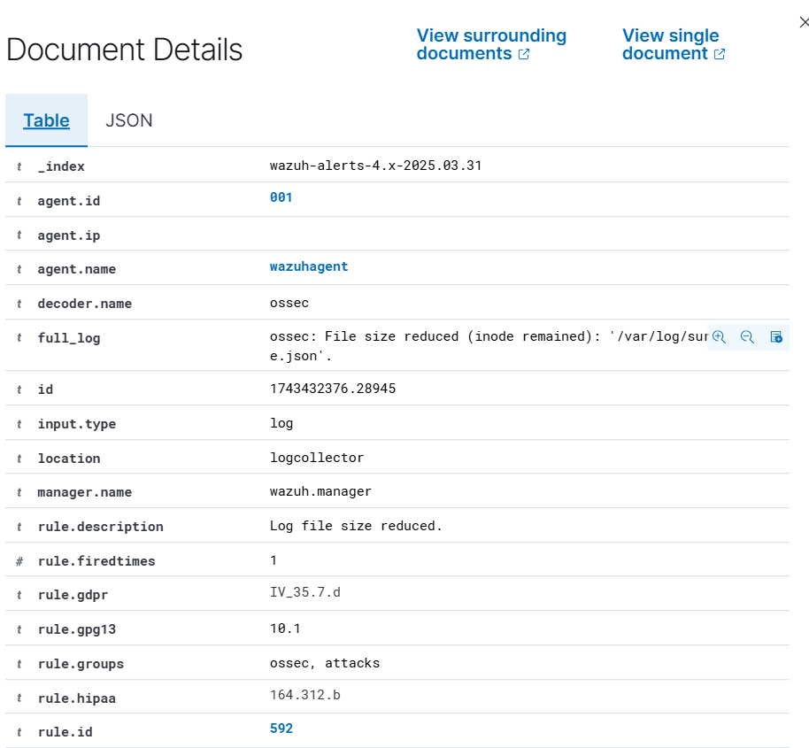
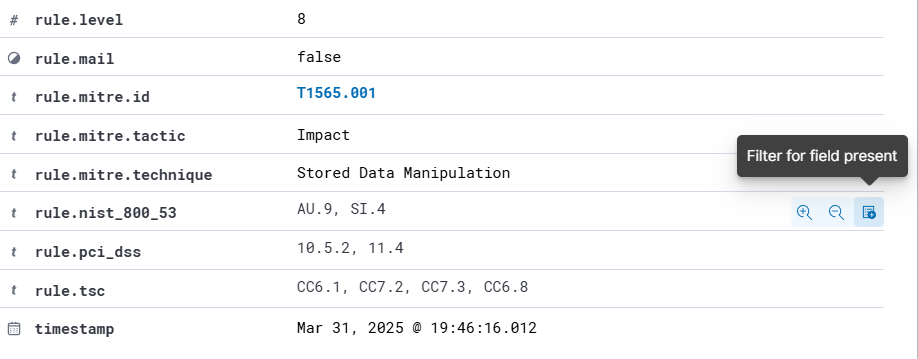

# Detection of Network Attacks in SIEM

## Project Overview
This project aims to simulate network attacks and detect them using a SIEM Solution. The setup includes a combination of **Wazuh and Suricata** to monitor and analyze network activity.

## 📌 Goals
- Simulate attacks using **Kali Linux**.
- Detect malicious activity with **Suricata** and log it in **Wazuh**.
- Analyze security events in the SIEM dashboard.
- Ensure accurate timestamps with **Chrony (NTP)**.
- Create and fine-tune **custom Wazuh rules**
- Implement a **Telegram bot** for alerting.

## 🛠 Technologies Used
- **Suricata** – NIDS to analyze traffic and detect potential attacks.
- **Wazuh SIEM** – Log collection and alerting.
- **Chrony (NTP)** - Time synchronization
- **Python** – For script of Telegram bot.

## 📊 Vizualization
Soon

## 🔍🛡️🚧 After Testing Attacks
1. ICMP Flood Attack (ping -f -c 20 <wazuhagent_ip>)
   
   
2. After Log Manipulation

   
   
   

