# Here you can find outputs from Wazuh dashboard and Telegram Bot after testing attacks that provided from the Kali machine to Windows user
### 1. Nmap OS detect 
   #### Kali:
   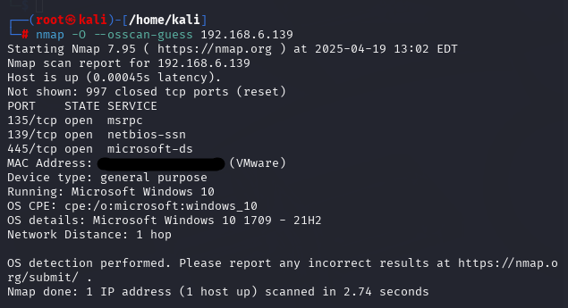
   #### Wazuh:
   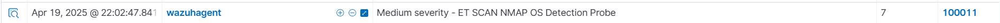
   #### Telegram Bot:
   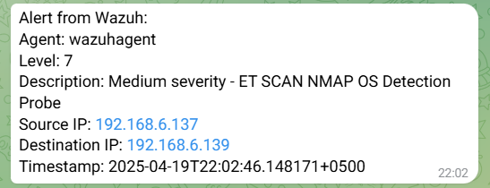
---------------------------------------------------------------------------------------------------------------------------------------------------------------------------------------------   
### 2. TCP XMAS scan
   #### Kali:
   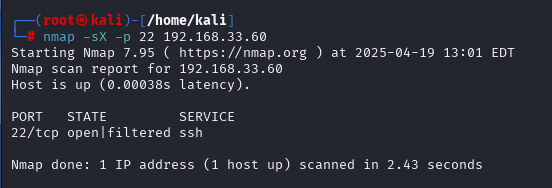
   #### Wazuh:
   
   #### Telegram Bot:
   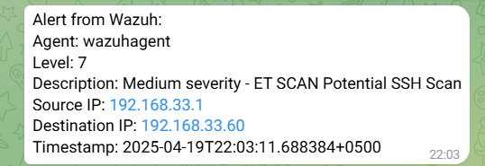
---------------------------------------------------------------------------------------------------------------------------------------------------------------------------------------------  
### 3. SSH BruteForce
   #### Windows(created testing user):
   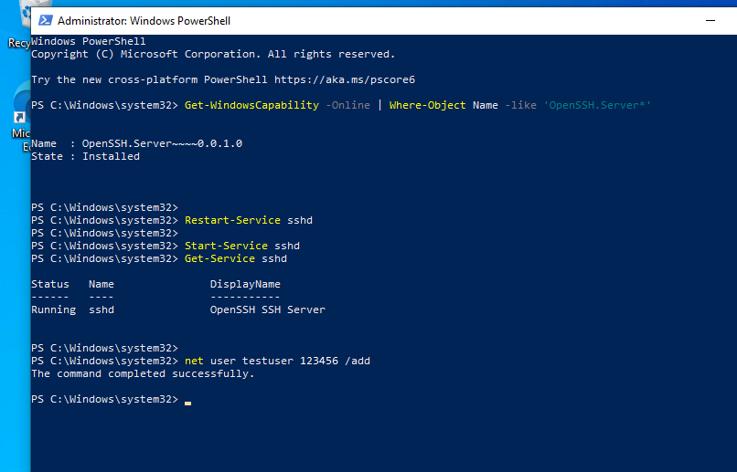
   #### Kali:
   
   #### Wazuh:
   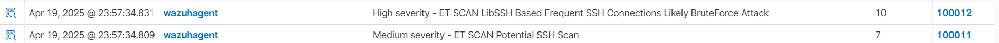
   #### Telegram Bot:
   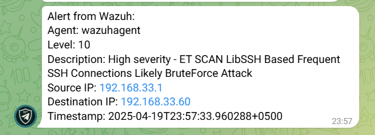
---------------------------------------------------------------------------------------------------------------------------------------------------------------------------------------------  
   ### 4. ICMP Ping
   #### Kali:
   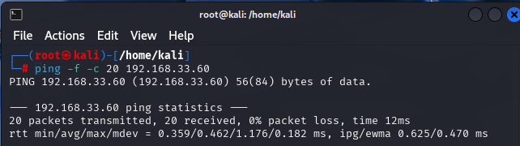
   #### Wazuh:
   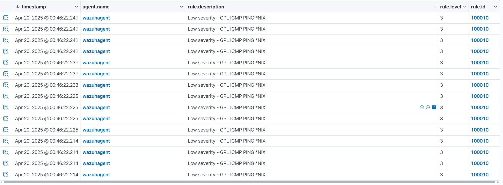
   #### Telegram:
      No outputs due to the low severity
--------------------------------------------------------------------------------------------------------------------------------------------------------------------------------------------- 
   ### 5. Detect HTTP traffic
   #### Kali(created testing google clone using Social-Engineer Toolkit):
   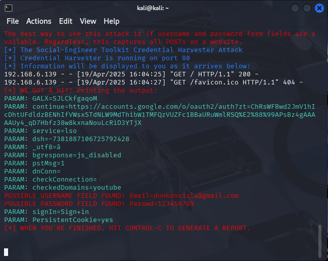
   #### Windows:
   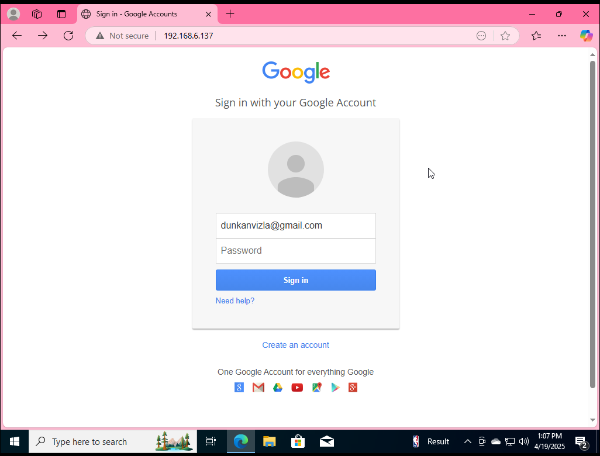
   #### Wazuh:
   
   #### Telegram Bot:
   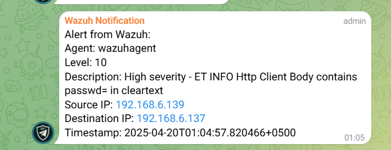

